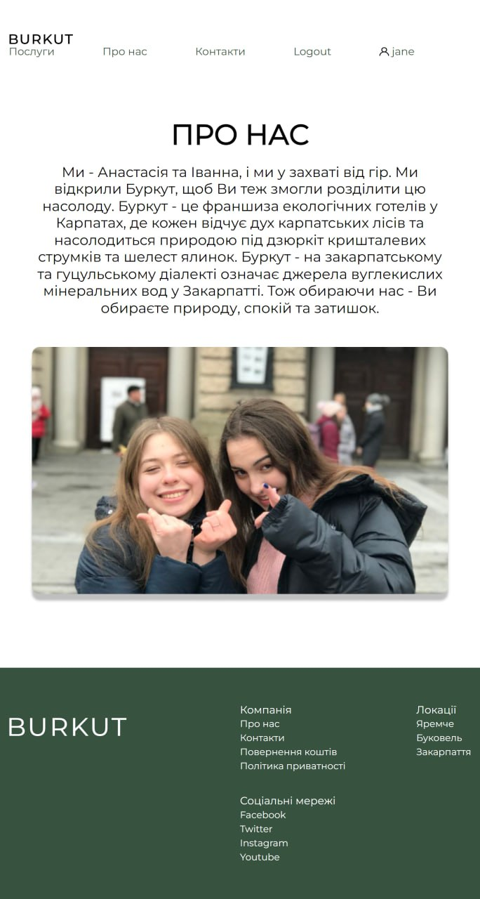

# Booking App

## Project Overview

Welcome to the Booking App! This web application allows users to seamlessly reserve hotel rooms, explore hotel details, and manage bookings. The app provides an intuitive user experience and leverages modern technologies to enhance your travel planning.

## Table of Contents

- [Architecture](#architecture)
- [Functionality](#functionality)
- - [User Authentication](#user-authentication)
- - [Hotel and Room Information](#hotel-and-room-information)
- - [Room Reservation](#room-reservation)
- - [Admin Management](#admin-management)
- [Technologies](#technologies)
- [Getting Started](#getting-started)
- [Contributors](#contributors)

## Architecture

The architecture of the Booking App is designed to ensure a seamless user experience. It includes:

1. **Information Architecture:** An effective way to organize the site's content and structure, providing clear navigation and user flow.

2. **Page Layouts:** Responsive page layouts built using ReactJS, ensuring a consistent and user-friendly interface on various devices and browsers.

3. **Data Handling:** MongoDB is used to efficiently store and manage data, while Node.js and Express handle server-side operations.

## Functionality

The Booking App offers the following key features:

### User Authentication

Users can create accounts and log in securely, enabling personalized experiences and access to reservation history.

### Hotel and Room Information

Explore detailed information about available hotels, their amenities, and room types.

### Room Reservation

Easily search for available rooms, choose your preferred dates, and make reservations hassle-free.

### Admin Management

Administrators can update hotel and room details, ensuring accurate and up-to-date information is available to users.

## Technologies

The Booking App is built using cutting-edge technologies:

- Front-End: ReactJS for dynamic and responsive user interfaces.
- Back-End: Node.js and Express for efficient server-side operations.
- Database: MongoDB for seamless data storage and retrieval.
- API Testing: Insomnia for smooth API interaction.

## Getting Started

To get started with the Booking App:

1. Clone the repository to your local machine.
2. Install the required dependencies using `npm install`.
3. Configure the `.env` file with necessary environment variables.
4. Run the app using `npm start`.

## How it's look like...

## Contribution Guidelines

We're excited to bring you a seamless booking experience with the Booking App!
